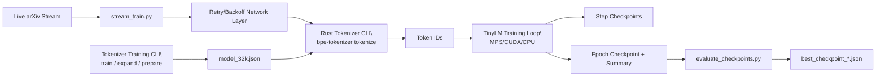

# Subword Tokenizer + Prototype Training Architecture

## Notes

- Training tokenization uses the project tokenizer model (`model_32k.json`) via Rust CLI.
- Long runs include retry/backoff to tolerate transient arXiv read timeouts.
- Evaluation ranks checkpoints by average eval loss and picks best automatically.
