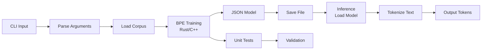

# Subword Tokenizer Architecture

```mermaid
graph LR
    A["CLI Input"] --> B["Parse Arguments"]
    B --> C["Load Corpus"]
    C --> D["BPE Training<br/>Rust/C++"]
    D --> E["JSON Model"]
    E --> F["Save File"]
    F --> G["Inference<br/>Load Model"]
    G --> H["Tokenize Text"]
    H --> I["Output Tokens"]
    D --> J["Unit Tests"]
    J --> K["Validation"]
```
