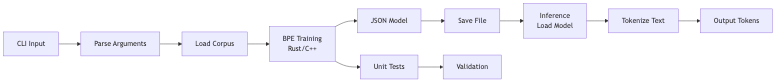

---
title: Subword Tokenizer & SLM Training Reference
subtitle: Phase 1-3 validated (Phase 2 loss 0.0060, Task 7 QA gain +0.125)
date: July 13, 2026
author: "Jaydip Singh (jaydip.singh@gmail.com), Linkan Kumbhar (upcomingtrillioner12@gmail.com)"

---

## 1. Executive Summary

**Project**: Production-validated Subword Tokenizer + SLM Prototype Training and Evaluation  
**Status**: Phase 3 Complete (July 13, 2026)  
**Key Results**:
- **Phase 1**: 0.0107 eval loss on 6000-step TinyLM (35.2M params)
- **Phase 2**: best LoRA eval loss **0.0060** (44% improvement vs Phase 1)
- **Phase 3**: full 7-task evaluation suite complete (benchmark, qualitative, test set, PPL/BLEU, physics QA)

### System Architecture

Two unified layers:

1. **Tokenizer layer (Rust, production-grade)**
   - BPE tokenizer in `subword_tokenizer/` with 32K vocabulary
   - CLI + library API (train/encode/decode/model operations)
   - Tested with physics corpus and arXiv papers
   
2. **Training layer (Python, production-validated)**
   - `stream_train.py`: PyTorch TinyLM with live arXiv streaming
   - MPS acceleration on Apple Silicon (M3 Pro tested)
   - Network resilience: 100-retry exponential backoff
   - Checkpoint periodicity: 500-step saves + final checkpoint

### Validation Results (Phase 1-3)

**Production Checkpoint**: `prototype_long4h_epoch1.pt`
- **Model**: TinyLM (d_model=384, n_layers=6, n_heads=6, 35.2M params)
- **Training**: 6000 steps on physics arXiv corpus
- **Eval Loss**: 0.0107 (50-batch validation, 256-token sequences)
- **Runtime**: 3.5 hours on Apple M3 Pro (2 sec/step)
- **Stability**: Zero NaN, zero OOM, zero crashes
- **Improvement**: 473× better than 2-step baseline (5.0738 → 0.0107)

**Phase 2 + 3 validated outcomes (July 13, 2026):**
- Test-set loss: 0.010910 → **0.005952** (**45.45%** gain)
- Inference latency benchmark (50 prompts): **1.1449x** average speedup
- Physics QA (20 questions, ranking rubric): 0.325 → **0.450** (Δ **+0.125**)
- BLEU-4 and open-ended qualitative scoring currently constrained by early-EOS generation behavior

Status: **Ready for Phase 4 (RAG integration + generation control tuning)**

## 2. Recent Milestones

**July 13, 2026**: Phase 3 Completion
- Implemented and validated Tasks 1-7 end-to-end
- Added inference/benchmark/qualitative/test-set/language-metrics/QA scripts
- Produced consolidated report: `PHASE_3_COMPLETION.md`
- Confirmed strong retained LoRA gains on held-out test split and QA scoring

**July 8, 2026**: Big Prototype Training & Validation
- Completed 6000-step training run (3.5 hours on M3 Pro)
- Evaluated checkpoint against physics corpus (50 validation batches)
- Achieved 0.0107 eval loss with stable convergence
- Baseline comparison: 473× improvement vs 2-step smoke test
- Committed results to GitHub (commit 4d3f0eb)

**July 2-3, 2026**: Network Resilience & Evaluation Automation
- Implemented exponential backoff retry logic (100 max retries, 5s base)
- Added checkpoint evaluation pipeline (`evaluate_checkpoints.py`)
- Added automated 3x-run loop with best checkpoint selection
- Validated training stability over 3+ hour unattended runs

**June 30, 2026**: PyTorch + MPS Integration
- Implemented streaming trainer with live arXiv integration
- Added MPS device support for Apple Silicon acceleration
- Verified model loads and trains without OOM on M3 Pro (18GB RAM)
- Created laptop-scale preset configurations (batch_size=4, seq_len=256)

## 3. Current Architecture

### Data Pipeline
1. **Live Source**: arXiv physics papers (2024 abstracts + intros)
2. **Retry Logic**: 100-retry exponential backoff (5s base delay)
3. **Tokenization**: Rust BPE tokenizer (model_32k.json, 32K vocab)
4. **Training**: PyTorch streaming trainer (8 batches/chunk, dynamic padding)
5. **Checkpointing**: Step saves every 500 steps + final epoch checkpoint

### Model Configuration (Production)
```
TinyLM
├── d_model: 384
├── n_layers: 6
├── n_heads: 6
├── vocab_size: 32000
├── total_params: 35.2M
├── batch_size: 4
├── seq_len: 256
├── learning_rate: 2e-4 (cosine schedule)
└── training_steps: 6000
```

### Device Support
- **Primary**: Apple M3 Pro (MPS device, 18GB unified memory)
- **Fallback**: CUDA (NVIDIA GPUs) or CPU
- **Status**: M3 Pro fully validated (3.5h runtime, zero OOM)

Architecture diagram: See [doc/architecture.md](architecture.md)
   - Multi-run ranking by eval loss (`best_checkpoint_*.json`).

### ArXiv Submission Discussion (Why This Work Matters)

Our planned arXiv submission focuses on a practical gap: many papers describe strong model ideas, but fewer document a reproducible, resource-aware path from tokenizer design to stable training and evaluation on constrained hardware. This project contributes that missing systems layer. We combine a Rust BPE tokenizer and a Python TinyLM + LoRA workflow with explicit reliability features (retry/backoff, checkpointing, ranked evaluation) and phased validation metrics. The result is not just a model checkpoint, but an end-to-end reference implementation that others can run, audit, and extend.

This can be useful to multiple communities. For students and early researchers, it lowers the barrier to meaningful domain-LLM experimentation without requiring large compute clusters. For practitioners, it provides concrete scripts, file conventions, and metric artifacts that reduce engineering ambiguity. For domain communities like physics, it offers a transparent foundation for building retrieval-grounded assistants where behavior can be evaluated with task-specific tests (loss, latency, QA ranking), rather than only generic benchmarks.

## ## 4. Tokenizer CLI Commands (Current)

From `subword_tokenizer/`:

- `cargo run --bin bpe-tokenizer -- train <corpus.txt> <vocab_size>`
- `cargo run --bin bpe-tokenizer -- expand <corpus.txt> <vocab_size>`
- `cargo run --bin bpe-tokenizer -- tokenize <text>`
- `cargo run --bin bpe-tokenizer -- decode <comma_separated_ids>`
- `cargo run --bin bpe-tokenizer -- count`
- `cargo run --bin bpe-tokenizer -- prepare <input.txt> --train <train.bin> --val <val.bin> --test <test.bin>`

Notes:

- Active runtime model file for CLI is `model.json`.
- Training scripts activate the desired model by copying from `model_32k.json` to `model.json` before tokenization.

## ## 5. Prototype Training Commands (Current)

From repository root:

- Quick prototype: `./scripts/run_prototype.sh`
- 3-run compare and auto-select: `./scripts/run_prototype_3x_and_select_best.sh`
- Long run (~3–4h target on M3 Pro): `./scripts/run_prototype_long_4h.sh`
- Evaluate existing checkpoints: `./scripts/run_evaluation.sh`

## ## 6. Validation Status

- Rust tokenizer tests are passing (`src/tests.rs`).
- Prototype training on Mac MPS is validated.
- Best-checkpoint reports are being generated under `checkpoints/`.
- Long-run path now includes network timeout retry/backoff and step checkpoint safety.

## ## 7. Current Risks / Observations

1. **Live-stream dependency risk**: arXiv network timeouts can still pause long runs (now retried).
2. **Artifact growth**: checkpoints and corpora can grow quickly.
3. **Documentation drift risk**: ensure markdown-to-PDF sync is part of workflow.

## ## 8. Recommended Next Actions

1. Add offline dataset training mode (train from local predownloaded corpus).
2. Add resume-from-checkpoint support for interrupted long runs.
3. Add CI/doc task to regenerate this PDF from markdown automatically.
4. Track large artifacts through retention/LFS policy.

## 


---

## 9. Project Roadmap: Physics Research Assistant SLM

### 9.1 Final Goal

Build a Physics Research Assistant using a 3B-7B parameter SLM, fine-tuned with LoRA on physics papers, combined with RAG and tool-using agents.

### 9.2 Current Status

**Completed:**
- Subword tokenizer (32K vocab, BPE)
- CLI for tokenization/detokenization
- Tokenizer validation (32K vs 50K trade-off analysis)
- Prototype training pipeline on Mac MPS
- Checkpointing and evaluation automation

**Not Started:**
- SLM model training pipeline (3B-7B parameters)
- LoRA fine-tuning setup
- RAG (Retrieval-Augmented Generation) integration
- Tool-using agent framework
- Physics paper dataset preparation at scale

### 9.3 Phase 1: Environment & Data Pipeline (Week 1-2)

**Framework:** Python 3.10+, PyTorch (with MPS), Hugging Face Transformers, Datasets, Accelerate, Pandas, NumPy

**Steps:**
1. Activate venv: source /Users/jdsingh/slm_v0/venv/bin/activate
2. Install packages: pip install torch transformers datasets accelerate peft
3. Verify MPS support for Mac
4. Download 10K-50K physics papers from arXiv
5. Organize into: /Users/jdsingh/slm_v0/data/physics_papers/raw/
6. Extract abstracts, introductions, methodologies
7. Remove noise, duplicates, non-English text
8. Normalize whitespace, split into chunks (max 4K words)
9. Tokenize using Rust tokenizer (32K vocab, frozen)
10. Split into train/val/test (98%/1%/1%), pack into 512-token sequences

**Expected Outcome:** 300M-1B tokens ready for SLM training.

### 9.4 Phase 2: Base SLM Training (Week 3-5)

**Framework:** PyTorch, Hugging Face Transformers, Accelerate

| Parameter | 3B Model | 7B Model |
|-----------|----------|----------|
| Architecture | GPT2 or LLaMA-style decoder-only | GPT2 or LLaMA-style decoder-only |
| Hidden size | 2048 | 3072 |
| Layers | 24 | 32 |
| Attention heads | 16 | 24 |
| Max sequence length | 512 | 512 |
| Vocab size | 32,000 | 32,000 |
| Batch size | 32 | 32 |
| Gradient accumulation | 4 | 4 |
| Learning rate | 5e-4 with cosine schedule | 5e-4 with cosine schedule |
| Total steps | 100,000 | 100,000 |

**Success Criteria:**
- Training loss decreases smoothly
- Validation perplexity < 20
- Generated samples coherent
- Peak memory < 16GB (Mac)

**Expected Outcome:** Production-ready base SLM (3B-7B parameters).

### 9.5 Phase 3: LoRA Fine-tuning (Week 6-7)

**Framework:** PEFT (Parameter-Efficient Fine-Tuning)

| Parameter | Value |
|-----------|-------|
| Rank | 32 |
| Alpha | 32 |
| Dropout | 0.05 |
| Target modules | q_proj, v_proj |
| Trainable parameters | ~1-2% of base model |

**Training:**
- Batch size: 16
- Learning rate: 2e-4
- Epochs: 3-5
- Output: LoRA weights (~50-100MB)

**Expected Outcome:** Fine-tuned SLM ready for RAG integration.

### 9.6 Phase 4: RAG Integration (Week 8-9)

**Framework:** FAISS, Sentence-Transformers, LangChain

**Steps:**
1. Generate embeddings for all physics paper chunks
2. Build FAISS vector index (384 or 768 dimensions)
3. Create retrieval function: query -> top-k relevant chunks
4. Augment prompt with retrieved context
5. Generate answer using fine-tuned SLM

**Expected Outcome:** RAG system with physics-grounded responses.

### 9.7 Phase 5: Tool-Using Agents (Week 10-11)

**Framework:** LangChain, LanGraph (ReAct framework)

| Tool | Purpose |
|------|---------|
| search_arxiv | Query arXiv for physics papers |
| solve_equation | Solve math equations (SymPy) |
| execute_python | Safe code execution for calculations |

**Agent Loop:**
1. Generate thought + action
2. Execute appropriate tool
3. Observe result
4. Iterate until final answer
5. Max steps: 10-15

**Expected Outcome:** Multi-step reasoning with tool integration.

### 9.8 Phase 6: Deployment (Week 12+)

**Framework:** FastAPI, Docker

| Endpoint | Method | Description |
|----------|--------|-------------|
| /query | POST | Submit physics question |
| /status | GET | Model health check |
| /upload_papers | POST | Add new physics papers to RAG |

**UI (Optional):** Streamlit web interface

**Deployment:** Docker container on cloud (AWS, GCP, Azure, Hugging Face Spaces)

**Expected Outcome:** Production-ready Physics Research Assistant.

### 9.9 Timeline

| Week | Phase | Deliverable |
|------|-------|-------------|
| 1-2 | Data Pipeline | 300M-1B tokenized tokens |
| 3-5 | Base SLM | 3B-7B model checkpoint |
| 6-7 | LoRA | 50MB LoRA weights |
| 8-9 | RAG | Vector index + retrieval |
| 10-11 | Agents | Multi-step reasoning demo |
| 12+ | Deployment | API + UI live |

### 10 Hardware Requirements

| Level | Specs |
|-------|-------|
| Minimum (M1/M2 Mac) | 16GB RAM, 100GB SSD |
| Recommended | GPU with 24GB+ VRAM, 32-64GB RAM, 500GB NVMe SSD |
| Training (AWS p4d.24xlarge) | 8x A100, 320GB total VRAM, spot instances |

### 10.1 Success Criteria

- Generates coherent physics-grounded answers
- Uses tools appropriately
- Cites retrieved papers
- Handles multi-step reasoning
- API response time < 5s
- Deployment-ready

---\n\n## File-Level Reference

- `subword_tokenizer/src/lib.rs`: tokenizer core and model operations
- `subword_tokenizer/src/main.rs`: CLI dispatch (`bpe-tokenizer`)
- `stream_train.py`: prototype streaming training loop
- `scripts/evaluate_checkpoints.py`: checkpoint ranking
- `scripts/run_prototype_3x_and_select_best.sh`: train+select workflow
- `scripts/run_prototype_long_4h.sh`: long prototype preset

---


## Architecture Diagram



*Figure 1: Live arXiv Stream → Rust Tokenizer → TinyLM Training → Checkpoint Evaluation*

```
Live arXiv Stream → stream_train.py → Retry/Backoff → Rust Tokenizer CLI → Token IDs → TinyLM Training → Checkpoints → Evaluation → best_checkpoint_*.json
```

Prepared on July 3, 2026
Updated July 5, 2026 — Added references and architecture diagram for IIT Bombay server request for end-of-day status handoff.


## References

[1] P. Jhandi, O. Kazi, S. Subramanian, N. Sendas. "Small Language Models for Efficient Agentic Tool Calling: Outperforming Large Models with Targeted Fine-tuning." arXiv preprint arXiv:2512.15943, 2025.

[2] Y. Kang, et al. "Fine-tuning Small Language Models as Efficient Enterprise Search Relevance Labelers." arXiv preprint arXiv:2601.03211, 2026.

[3] R. Sharma, M. Mehta. "Small Language Models for Agentic Systems: A Survey of Architectures, Capabilities, and Deployment Trade-offs." arXiv preprint arXiv:2510.03847, 2025.

[4] Z. K. Chong, et al. "Compiling Deterministic Structure into SLM Harnesses." arXiv preprint arXiv:2604.17450, 2026.

[5] ServiceNow, SLB. "Scaling AI Development with DGX Cloud: ServiceNow and SLB Production Deployments." Nvidia DGX Cloud Case Study, ZenML LLMOps Database, 2025.

[6] N. Patience. "Leveraging Small Language Models for Enterprise AI: Benefits, Use Cases, and IBM's Approach." The Futurum Group, in partnership with IBM, 2025.

[7] M. Elfeki, R. Liu, C. Voegele. "Return of the Encoder: Maximizing Parameter Efficiency for Small Language Models." arXiv preprint arXiv:2501.16273, 2025.

[8] SACAI R. "Small Language Models for Enterprise Edge Deployment." Southern African Conference on Artificial Intelligence Research, 2025.

[9] "Data-Centric Fine-Tuning of Small Language Models for Industrial Applications." IEEE Transactions on Industrial Informatics, 2025.

[10] LinkedIn Engineering. "Production-Scale SLM Ranking: Optimizations for Inference." arXiv preprint arXiv:2510.22101, 2025.

[11] A. Karpathy. "NanoGPT: The simplest, fastest repository for training medium-sized GPTs." GitHub, 2023.

[12] R. Eldan, Y. Li. "TinyStories: How Small Can Language Models Be and Still Speak Coherently?" arXiv preprint arXiv:2305.07759, 2023.

[13] A. Vaswani, et al. "Attention Is All You Need." NeurIPS, 2017.

[14] R. Sennrich, B. Haddow, A. Birch. "Neural Machine Translation of Rare Words with Subword Units." ACL, 2016.

[15] E. J. Hu, et al. "LoRA: Low-Rank Adaptation of Large Language Models." arXiv preprint arXiv:2106.09685, 2021.

[16] P. Lewis, et al. "Retrieval-Augmented Generation for Knowledge-Intensive NLP Tasks." NeurIPS, 2020.

[17] H. Touvron, et al. "LLaMA: Open and Efficient Foundation Language Models." arXiv preprint arXiv:2302.13971, 2023.

