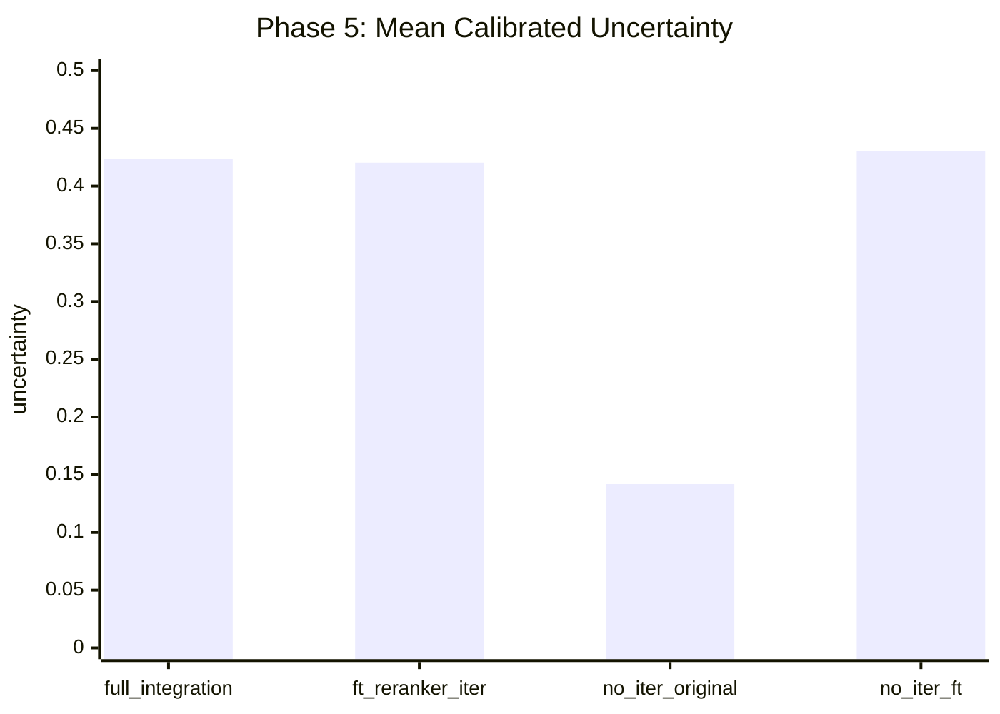

# Figure: Calibrated Uncertainty by Configuration

```mermaid
xychart-beta
    title "Phase 5: Mean Calibrated Uncertainty"
    x-axis [full_integration, ft_reranker_iter, no_iter_original, no_iter_ft]
    y-axis "uncertainty" 0 --> 0.5
    bar [0.4234, 0.4203, 0.1419, 0.4304]
```

Source: `results/rag_generation_eval/seed_runs/seed_significance_summary.csv`
