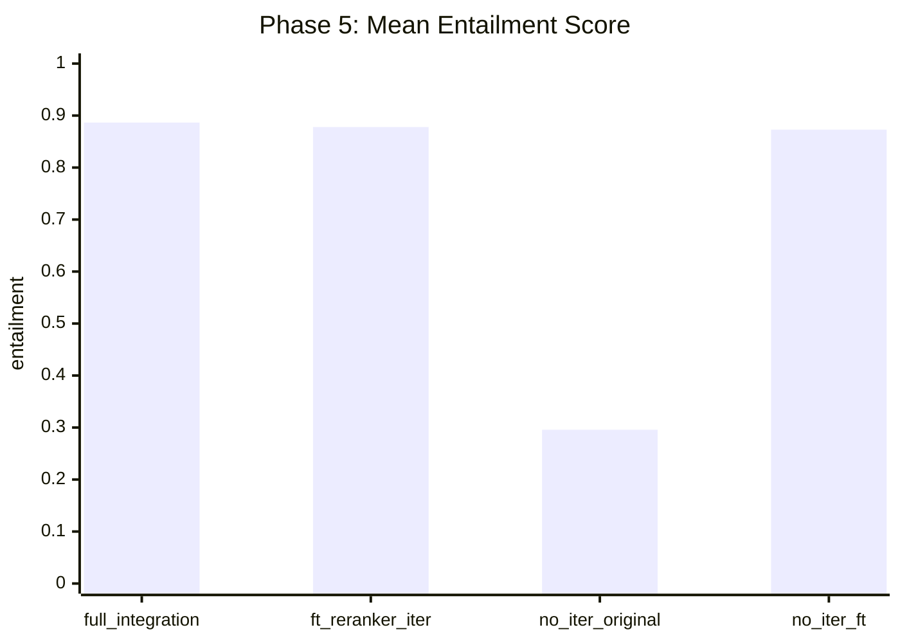

# Figure: Entailment Consistency by Configuration

```mermaid
xychart-beta
    title "Phase 5: Mean Entailment Score"
    x-axis [full_integration, ft_reranker_iter, no_iter_original, no_iter_ft]
    y-axis "entailment" 0 --> 1.0
    bar [0.8865, 0.8780, 0.2957, 0.8729]
```

Source: `results/rag_generation_eval/seed_runs/seed_significance_summary.csv`
