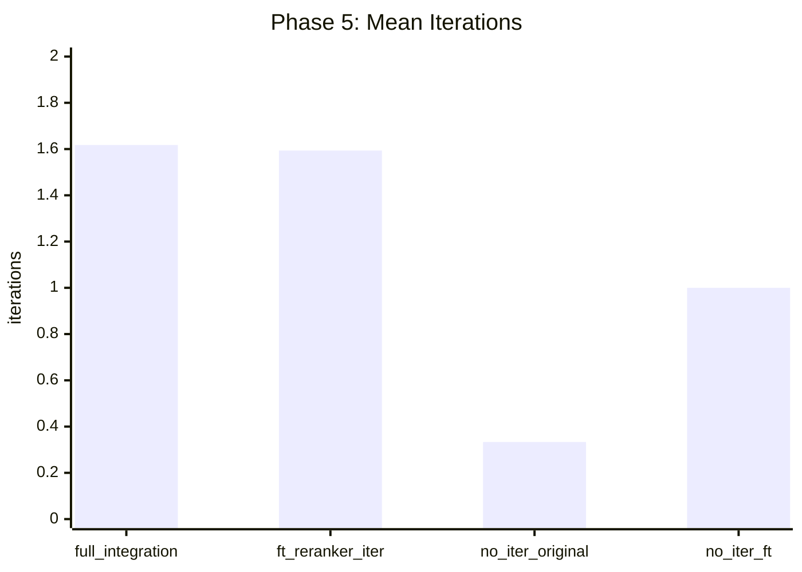

# Figure: Iterative Retrieval Usage by Configuration

```mermaid
xychart-beta
    title "Phase 5: Mean Iterations"
    x-axis [full_integration, ft_reranker_iter, no_iter_original, no_iter_ft]
    y-axis "iterations" 0 --> 2.0
    bar [1.6176, 1.5935, 0.3333, 1.0000]
```

Source: `results/rag_generation_eval/seed_runs/seed_significance_summary.csv`
